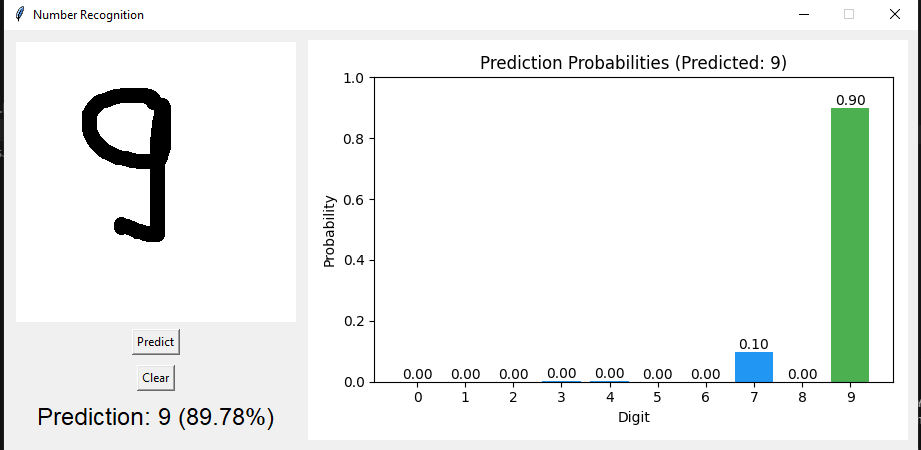

#  **Number Identification** – Handwritten Digit Recognition

Welcome to Number Identification, a fun and interactive project where you can draw a digit on the screen, and a trained neural network will predict what it is. This project combines deep learning with a simple GUI, offering a hands-on demonstration of digit recognition using the MNIST dataset.

---

##  Features

-  Draw digits (0–9) directly in a window
-  Predicts handwritten digits using a trained neural network
-  Built on the MNIST dataset for high accuracy
-  Easy to clear and redraw with a button click
-  Real-time prediction using a lightweight, efficient model

---

##  How to Run

### 1. Clone the Repository

```bash
git clone https://github.com/KathanParikh/Number_Identification.git
cd Number_Identification
```
### 2. Install Required Dependencies
- Install the necessary Python packages using pip:
```bash
pip install -r requirements.txt
```

### 3. Train the Model
- To train the neural network on the MNIST dataset and save the trained model locally:
```bash
python python.py
```
This will:
- Download the MNIST dataset
- Train a simple neural network for 5 epochs
- Save the model to a file named mnist_model.h5
- Note: You only need to run this step once unless you want to retrain the model.

### 4. Launch the Digit Drawing GUI
- Once the model is trained, launch the interactive interface where you can draw digits:
```bash
python python.py gui
```
- A window will open where you can draw a number (0–9) using your mouse.
- Click "Predict" to let the model guess your digit.
- Use "Clear" to reset the canvas and try again.

---
## Demo


---
